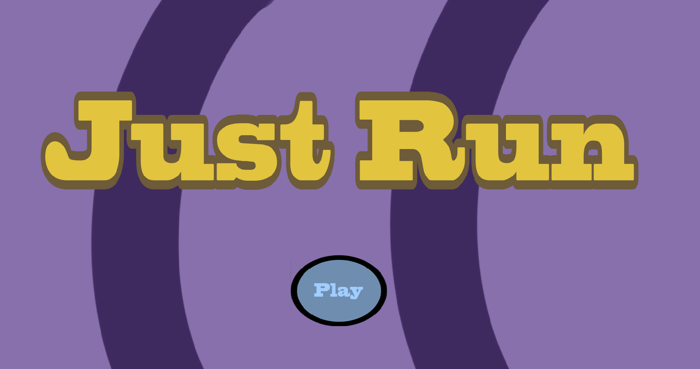
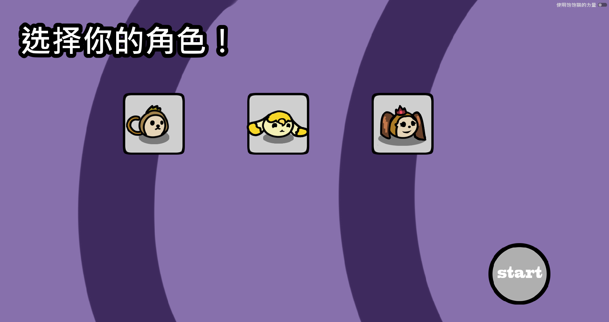
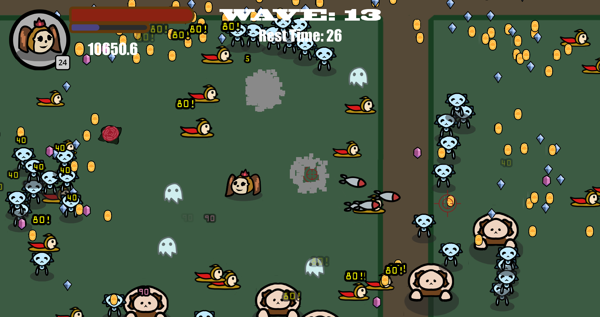
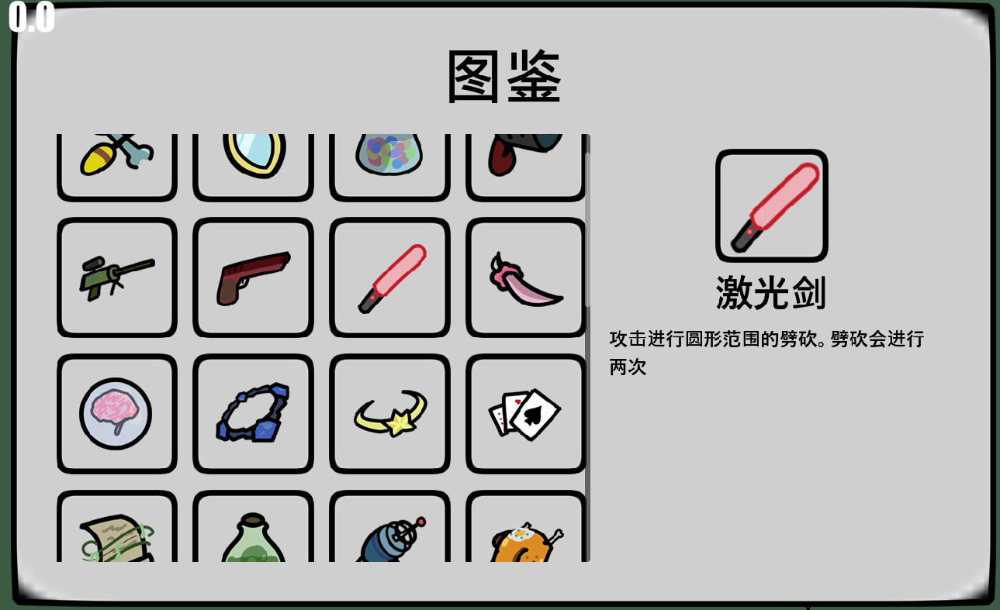

<h1 align="center">Just Run2</h1>

<div align="center"> 
  
</div>

# 📄 Content
- [最新消息](#🔥-news)
- [游戏介绍](#👋-introduction)
- [游戏下载](#🔽-download)

# 🔥 News
- [2025.08.18]Doney 发布了 Just Run2 第一版！
- [2025.09.01]Doney 修复了一些 Bug，将游戏曲线进行了一些修改。现在游戏难度更简单，时间更短了。

# 👋 Introduction

Just Run2 是一个基于 Godot 引擎的 2D 游戏，它是 Just Run 游戏的第二版（其实第一版根本没有作为游戏发行）。Just Run2主要玩法是Rougelike，在本游戏中，你可以通过购买道具来获取新的武器、升级现有武器来不断增强自己。

<div align="center">


</div>

Just Run2没有引导，你需要记住的就是按 B 打开背包，将武器拖入上方的槽。按 M 键打开天赋界面，升级天赋点。以及打开 T 键，查看你不知道的武器信息。


<div align="center">


</div>


争取一次通过Just Run2！😎
# 🔽 Download

直接通过以下链接下载游戏👉（目前使用的Windows11）：
[Just Run2 第一版](https://github.com/Dsixy/JustRun2/releases/download/Game/Just.Run.zip)

你也可以通过git clone下载游戏：
```
git clone https://github.com/Doney123/JustRun2.git
```
当然，你需要Godot4.2.2版本编辑器并导入项目，使用Godot自带的导出功能即可。

# 🔗 Cite
- 感谢《吸血鬼幸存者》提供的BGM🎵
  
# 🥰 Support Us
如果您喜欢 Just Run2 并想支持我们的开发，请考虑以下方式：
- 给我们的项目点个 Star ⭐
- 分享游戏到您的好友
- 关注我们的社交媒体账号（目前还没有）
- 捐赠我们的项目（捐赠你发现的Bug或者建议就够了，但Doney很懒，他不一定会修）

# 🥲 碎碎念
纯粹是满足自己想做游戏的需求，也没有什么特别的设计，只是想做一个简单的游戏，作为大学四年的一个纪念品。但是由于没啥经验，做到后面发现很多功能都加不上，一开始的构想（通过设计武器攻击顺序，将回合制的思想引入Rougelike）也没有实现。

这个项目就当是练手，练习一下自己的代码能力，也希望能在这个项目中学习到一些东西。对于整个游戏的设计，我会考虑公开我的设计文档。


